# Teilprogramm-Abhängigkeits-Ablaufdiagramm (BAUMFORM)

> **Aufgabe B3** (User 2026-06-25, früh / low-risk). Abhängigkeitsbaum der vier
> COMDARE-Diplomarbeit-Teilprogramme. **Alle Kanten sind aus echtem CMake-/Git-
> Code abgeleitet** (`add_executable` / `add_library` / `target_link_libraries` /
> `add_subdirectory` über die `CMakeLists.txt` von cache-engine + prt-art +
> Diplomarbeit-Code, plus `.gitmodules` und `comdare_pruefling.cmake`), **nicht
> geraten**. Belegstellen stehen je Kante in eckigen Klammern.

**Wurzel:** `C:\Users\benja\OneDrive\Desktop\Diplomarbeit - Datenbanken`

---

## 1. Architektur in einem Satz (3 Kopplungs-Stärken)

| # | Kopplung | Mechanismus | Stärke |
|---|----------|-------------|--------|
| A | **Diplomarbeit-Super-Repo → cache-engine** | Git-Submodul + `add_subdirectory(... EXCLUDE_FROM_ALL)`; die Pipeline-Module **linken** ausgewählte cache-engine-Library-Targets dynamisch dazu | **lose, externe Abhängigkeit** (super lädt cache-engine, baut nur was es braucht) |
| B | **cache-engine ↔ prt-art** | cache-engine **lädt prt-art als Plugin** (`-DCOMDARE_CE_PRUEFLINGE=<prt-art>` → `comdare_pruefling.cmake`); prt-art **füllt** je Achse den reservierten C++-Slot `optional_prt_art_impl` via Metaprogrammierung | **Modul-Kopplung via Meta-Programmierung** (Prüfling steckt nur seine Achse ein, Framework ergänzt Defaults) |
| C | **thesis ← Mess-Artefakte** | thesis ist eigenes Submodul; **konsumiert** den von der Mess-Pipeline erzeugten LaTeX-Anhang (Tabellen `csv_to_latex` + Diagramme `diagram_generator`), gebaut über die aus cache-engine kopierte `latex_toolchain.cmake` | **Artefakt-Konsum** (kein Code-Link; PDF aus generiertem LaTeX) |

Belegte Kern-Kette (wörtlich aus
`Code/external/comdare-cache-engine/docs/architecture/21_f6_plugin_controller_slot_merge_3stufen_bewiesen.md` §1):

```
cache-engine LÄDT prt-art als Plugin           [E11 Plugin-Controller]
   → prt-art FÜLLT CE-Achsen-Slots             [Phase B Slot-Füllung: optional_prt_art_impl]
      → 3-Stufen MERGEN Slots → Permutations-Räume
         → count() = Binary-Set-Größe pro Stufe (Compile-Time)
```

---

## 2. ASCII-Abhängigkeitsbaum

Legende der Pfeile:
`──submodule──▶` Git-Submodul · `──add_subdir──▶` CMake `add_subdirectory` ·
`──link──▶` `target_link_libraries` · `──include──▶` `target_include_directories`
(Header-only Kopplung) · `··plugin··▶` Plugin-Controller-Laden (Meta-Slot) ·
`==artifact==▶` Datei-/Artefakt-Konsum zur Laufzeit.

```
Diplomarbeit  (Super-Repo, Git-Wurzel)
│   .gitmodules + Code/CMakeLists.txt (project comdare-diplomarbeit-code, C++23)
│
├──submodule──▶ thesis/diplomarbeit           [.gitmodules: 20260931-overleaf-diplomarbeit.git]
│                  └─ konsumiert LaTeX-Anhang (Tabellen + Diagramme)  ◀==artifact== (siehe Mess-Pipeline)
│
├──submodule──▶ Code/external/comdare-cache-engine   [.gitmodules: comdare-cache-engine.git]
│   │  (add_subdirectory EXCLUDE_FROM_ALL  [Code/CMakeLists.txt:172])
│   │
│   │  ── von der Diplomarbeit genutzte Library-Targets (Top-Level-Konsum) ──
│   ├─ comdare_builder_experiment_driver   [libs/cache_engine/builder/experiment_driver/CMakeLists.txt]
│   │     └──link──▶ comdare_builder_xml_config_parser
│   │     └──link──▶ comdare_builder_codegen
│   │     └──link──▶ comdare_builder_permutation_loop
│   │     └──link──▶ comdare_module_loader
│   │     └──link──▶ comdare::workload_generator
│   │     └──link──▶ comdare::experiment
│   ├─ comdare::workload_generator          [libs/test_infra/workload_generator/CMakeLists.txt]
│   ├─ comdare::experiment                  [libs/execution_engine/CMakeLists.txt]
│   │     └──link──▶ comdare::workload_generator
│   │     └──link──▶ comdare::benchmark_suite
│   ├─ tools/latex_toolchain/latex_toolchain.cmake  (configure_file → Stufe 06)
│   │
│   │  ── cache-engine eigene Subdomänen (add_subdirectory, Auszug) ──
│   ├─ libs/search_engine · libs/cache_engine (+22 Builder-Subkomp.) · adapters · ext
│   ├─ libs/common · libs/test_infra · tools · apps · benchmarks · tests
│   │
│   └··plugin··▶ comdare-prt-art   [Root-CMakeLists.txt:483 foreach(COMDARE_CE_PRUEFLINGE)
│                                    → include(<prt-art>/comdare_pruefling.cmake)]
│                  prt-art füllt je Achse  comdare::cache_engine::<axis>::optional_prt_art_impl
│                  [libs/cache_engine/axes/axis_centric_namespaces.hpp:146-170]
│
├──submodule──▶ Code/external/comdare-prt-art         [.gitmodules: comdare-prt-art.git]
│   │  (add_subdirectory EXCLUDE_FROM_ALL  [Code/CMakeLists.txt:181]
│   │   mit COMDARE_PRT_ART_BUILD_TESTS=OFF, COMDARE_PRT_ART_USE_CACHE_ENGINE=OFF)
│   └─ comdare_prt_art_core (INTERFACE / header-only)  [prt-art/CMakeLists.txt:59]
│         └──include──▶ cache-engine libs/cache_engine/include  (<cache_engine/...>)
│         └──include──▶ cache-engine libs/cache_engine          (<topics/...>, <anatomy/...>)
│            ⇒ prt-art KONSUMIERT cache-engine als Werkzeug (REV 6: Prüfling, CE=Werkzeug)
│
└── Code/  Anwender-Schicht: 6-stufige Pipeline-Module  [Code/CMakeLists.txt:301-306]
    │
    ├─ 01_sample_data_generator
    │     └─ add_executable sample_data_generator     (standalone, KEIN Link; synthetische 16-Spalten-CSV)
    │
    ├─ 02_messung_driver
    │     ├─ add_executable messung_driver  (OUTPUT comdare-messung-driver)
    │     ├──link──▶ comdare_builder_experiment_driver   (cache-engine)
    │     ├──link──▶ comdare::workload_generator         (cache-engine)
    │     └──include──▶ prt_art/include                  (prt-art Prüfling-Header)
    │
    ├─ 03_binary_to_csv
    │     ├─ comdare_binary_to_csv (lib M03)   └──include──▶ cache-engine ABI (module_abi_v1.hpp)
    │     └─ add_executable binary_to_csv_cli (OUTPUT binary-to-csv) └──link──▶ comdare::binary_to_csv
    │
    ├─ 04_csv_to_latex
    │     ├─ comdare_csv_to_latex (lib M04)
    │     └─ add_executable csv_to_latex_cli (OUTPUT csv-to-latex)  └──link──▶ comdare::csv_to_latex
    │
    ├─ 05_diagram_generator
    │     ├─ comdare_diagram_generator (lib M05)
    │     └─ add_executable diagram_generator_cli (OUTPUT diagram-generator) └──link──▶ comdare::diagram_generator
    │
    ├─ 06_latex_to_pdf
    │     └─ CMake-only (kein C++): configure_file kopiert cache-engine latex_toolchain.cmake
    │        + build_thesis.sh/.bat  ==▶ pdflatex 2× + bibtex
    │
    └─ tests/  (GoogleTest 1.15.2 via FetchContent  [Code/CMakeLists.txt:278-292])
          ├──link──▶ comdare::binary_to_csv / csv_to_latex / diagram_generator
          └──link──▶ comdare_builder_experiment_driver, comdare::workload_generator, comdare::experiment
```

---

## 3. Mess-Pipeline-Ablauf (Datenfluss, 6 Stufen)

Eigene Achse: **Build-Abhängigkeit** (oben) ≠ **Laufzeit-Datenfluss** (hier).
CMake-Orchestrierungs-Target `comdare_pipeline_e2e` treibt EINEN Datensatz
geschlossen durch die Kette  [Code/CMakeLists.txt:328-341]:

```
[02] messung_driver ──▶ measurement_record (*.bin, magic 0xC0FFEE02)
        │  (nutzt cache-engine ExperimentDriver + Permutations-DLLs)
        ▼
[03] binary-to-csv  ──▶ 16-Spalten-CSV   (deserialisiert ABI-Binary)
        ▼
        ├──▶ [04] csv-to-latex      ──▶ booktabs-LaTeX-Tabelle  (*.tex)
        └──▶ [05] diagram-generator ──▶ TikZ/pgfplots-Diagramm  (*.tex, --by-workload)
                         │
                         ▼
[06] latex-to-pdf (latex_toolchain.cmake, pdflatex 2× + bibtex)
        ▼
   thesis/diplomarbeit  ──▶  Diplomarbeit-PDF
```

Demo-Pfad ohne reale HW-Messung (für Abnahme):
`[01] sample_data_generator → 16-Spalten-CSV → [04]+[05] → [06] pipeline_demo.pdf`
[Code/CMakeLists.txt:331-337].

---

## 4. Mermaid-Graph

```mermaid
graph TD
    subgraph SUPER["Diplomarbeit (Super-Repo / Git-Wurzel)"]
        DA["Code/CMakeLists.txt<br/>comdare-diplomarbeit-code (C++23)"]
    end

    subgraph PIPE["Code/ Anwender-Pipeline (6 Stufen)"]
        M01["01 sample_data_generator<br/>(exe, standalone)"]
        M02["02 messung_driver<br/>(exe: comdare-messung-driver)"]
        M03["03 binary_to_csv<br/>(lib M03 + binary-to-csv)"]
        M04["04 csv_to_latex<br/>(lib M04 + csv-to-latex)"]
        M05["05 diagram_generator<br/>(lib M05 + diagram-generator)"]
        M06["06 latex_to_pdf<br/>(CMake-only Toolchain)"]
        MT["tests/ (GoogleTest)"]
    end

    subgraph CE["comdare-cache-engine (Framework + Plugin-Controller)"]
        CE_ED["comdare_builder_experiment_driver"]
        CE_WG["comdare::workload_generator"]
        CE_EX["comdare::experiment"]
        CE_BS["comdare::benchmark_suite"]
        CE_ML["comdare_module_loader"]
        CE_XML["comdare_builder_xml_config_parser"]
        CE_CG["comdare_builder_codegen"]
        CE_PL["comdare_builder_permutation_loop"]
        CE_LTX["tools/latex_toolchain.cmake"]
        CE_SLOT["axes::optional_prt_art_impl<br/>(reservierter Meta-Slot je Achse)"]
    end

    subgraph PA["comdare-prt-art (Prüfling)"]
        PA_CORE["comdare_prt_art_core<br/>(INTERFACE / header-only)"]
        PA_PR["comdare_pruefling.cmake<br/>(Plugin-Registrierung)"]
    end

    subgraph TH["thesis/diplomarbeit (Manuskript-Submodul)"]
        TH_PDF["Diplomarbeit-PDF"]
    end

    %% --- Git-Submodule (lose) ---
    DA -. submodule .-> CE
    DA -. submodule .-> PA
    DA -. submodule .-> TH
    DA -- add_subdirectory EXCLUDE_FROM_ALL --> CE
    DA -- add_subdirectory EXCLUDE_FROM_ALL --> PA
    DA --> PIPE

    %% --- Pipeline-Build-Kanten (target_link_libraries) ---
    M02 -- link --> CE_ED
    M02 -- link --> CE_WG
    M02 -. include .-> PA_CORE
    M03 -. include ABI .-> CE
    M06 -- configure_file --> CE_LTX
    MT -- link --> M03
    MT -- link --> M04
    MT -- link --> M05
    MT -- link --> CE_ED

    %% --- cache-engine interne Link-Kanten ---
    CE_ED -- link --> CE_XML
    CE_ED -- link --> CE_CG
    CE_ED -- link --> CE_PL
    CE_ED -- link --> CE_ML
    CE_ED -- link --> CE_WG
    CE_ED -- link --> CE_EX
    CE_EX -- link --> CE_WG
    CE_EX -- link --> CE_BS

    %% --- Meta-Kopplung cache-engine <-> prt-art ---
    CE -. "plugin: COMDARE_CE_PRUEFLINGE" .-> PA_PR
    PA_PR --> CE_SLOT
    PA_CORE -. "include (CE als Werkzeug)" .-> CE

    %% --- Laufzeit-Datenfluss (Mess-Pipeline) ---
    M01 -. CSV .-> M04
    M01 -. CSV .-> M05
    M02 == bin ==> M03
    M03 == CSV ==> M04
    M03 == CSV ==> M05
    M04 == tex ==> M06
    M05 == tex ==> M06
    M06 == PDF ==> TH_PDF

    classDef art fill:#eef,stroke:#88a;
    class TH_PDF,CE_SLOT art;
```



---

## 5. Legende / Lesehilfe

- **Vier Teilprogramme.** (1) *Diplomarbeit-Super-Repo* = Anwender-Schicht (`Code/`,
  Experiment-Orchestrator + Auswertung); (2) *comdare-cache-engine* = Achsen-Library-
  Framework **und** Plugin-Controller; (3) *comdare-prt-art* = experimenteller
  Such-Algorithmus-**Prüfling** (konsumiert cache-engine als Werkzeug); (4)
  *thesis/diplomarbeit* = LaTeX-Manuskript, das die Mess-Artefakte einbindet.
- **Lose externe Abhängigkeit (A).** Das Super-Repo bindet cache-engine und prt-art
  als **parallele** (nicht verschachtelte) Git-Submodule unter `Code/external/` und
  baut sie via `add_subdirectory(... EXCLUDE_FROM_ALL)` — es wird nur kompiliert, was
  ein Pipeline-Modul tatsächlich per `target_link_libraries`/`target_include_directories`
  anzieht. Der einzige schwere Library-Konsum ist `comdare_builder_experiment_driver`
  (+ `workload_generator`/`experiment`) durch `02_messung_driver`.
- **Meta-Programmier-Kopplung (B).** cache-engine + prt-art sind **nicht** über einen
  klassischen Library-Link gekoppelt, sondern über das **Plugin-Controller-Slot-Modell**:
  Die Diplomarbeit (oder ein direkter cache-engine-Build) setzt
  `-DCOMDARE_CE_PRUEFLINGE=<prt-art>`; cache-engine inkludiert dann
  `comdare_pruefling.cmake`, und prt-art **spezialisiert** je Achse den reservierten
  C++-Namespace-Slot `comdare::cache_engine::<axis>::optional_prt_art_impl`. Header-seitig
  zieht `comdare_prt_art_core` (INTERFACE-Target) die cache-engine-Includes — der Prüfling
  benutzt das Framework, nie umgekehrt (REV 6, „PRT-ART ist Prüfling, CacheEngine ist Werkzeug").
- **Artefakt-Konsum (C).** `thesis/diplomarbeit` hat **keine** Code-Kante zu den Engines.
  Es konsumiert die von Stufe 04/05 erzeugten `.tex`-Dateien, die Stufe 06 mit der aus
  cache-engine kopierten `latex_toolchain.cmake` zum PDF baut.
- **Zwei Kantenarten getrennt halten.** Durchgezogene/`link`/`include`/`add_subdir`-Kanten
  = **Build-Zeit-Abhängigkeit**. `==artifact==`/`bin`/`CSV`/`tex`/`PDF` = **Laufzeit-
  Datenfluss** der Mess-Pipeline. Der CMake-Target `comdare_pipeline_e2e` führt den
  Laufzeitfluss geschlossen vor.
- **C++-Standard.** Alle drei Code-Repos erzwingen **C++23** (`cmake_minimum_required 3.28`);
  Tests laufen unter GoogleTest 1.15.2 (FetchContent, lokaler Tarball-Cache aus cache-engine).

---

## 6. Quellen (verifizierte CMake-/Code-Belege)

| Kante / Aussage | Datei |
|---|---|
| 3 Submodule (prt-art, cache-engine, thesis) | `.gitmodules` |
| Super lädt Engines via `add_subdirectory EXCLUDE_FROM_ALL` | `Code/CMakeLists.txt:172,181` |
| 6 Pipeline-Module registriert | `Code/CMakeLists.txt:301-306` |
| E2E-Orchestrierung (Datenfluss-Target) | `Code/CMakeLists.txt:328-341` |
| `messung_driver` → ExperimentDriver + workload_generator | `Code/02_messung_driver/CMakeLists.txt:13-16` |
| `binary_to_csv` → cache-engine ABI-Include | `Code/03_binary_to_csv/CMakeLists.txt:8-11` |
| `csv_to_latex` / `diagram_generator` CLI-Links | `Code/04_csv_to_latex/CMakeLists.txt:13` · `Code/05_diagram_generator/CMakeLists.txt:13` |
| Stufe 06 kopiert cache-engine latex_toolchain | `Code/06_latex_to_pdf/CMakeLists.txt:10-13` |
| Test-Links auf alle 5 Module + Engine-Targets | `Code/tests/CMakeLists.txt:18-43` |
| `experiment_driver` interne Link-Kanten | `Code/external/comdare-cache-engine/libs/cache_engine/builder/experiment_driver/CMakeLists.txt:12-19` |
| `comdare::experiment` → workload_generator + benchmark_suite | `Code/external/comdare-cache-engine/libs/execution_engine/CMakeLists.txt:13-16` |
| Plugin-Controller-Load-Loop (`COMDARE_CE_PRUEFLINGE`) | `Code/external/comdare-cache-engine/CMakeLists.txt:483-490` |
| prt-art Plugin-Registrierungs-Snippet | `Code/external/comdare-prt-art/comdare_pruefling.cmake` |
| `comdare_prt_art_core` INTERFACE + CE-Includes | `Code/external/comdare-prt-art/CMakeLists.txt:59-65` |
| `optional_prt_art_impl`-Slot je Achse | `Code/external/comdare-cache-engine/libs/cache_engine/axes/axis_centric_namespaces.hpp:146-170` |
| Bewiesene thesis-zentrale Kette (§1) | `Code/external/comdare-cache-engine/docs/architecture/21_f6_plugin_controller_slot_merge_3stufen_bewiesen.md` |

---

*Erstellt: 2026-06-25 · Aufgabe B3 · Kanten aus echtem CMake-Target-Graph +
`.gitmodules` + Plugin-Controller-Snippet abgeleitet, nicht geraten.*
