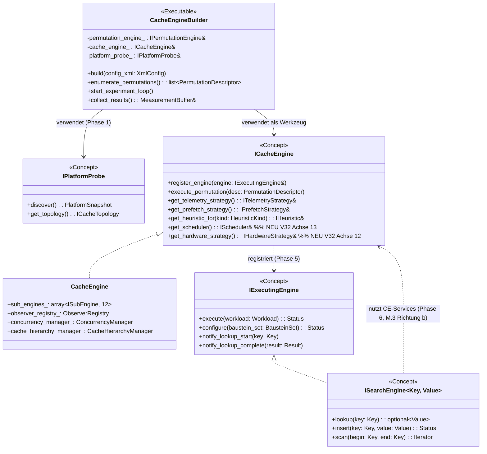
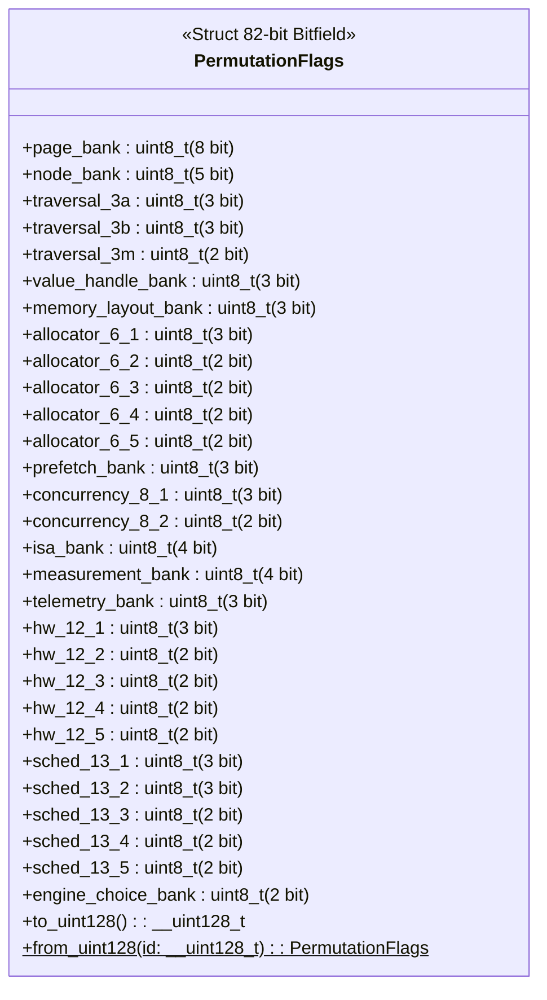
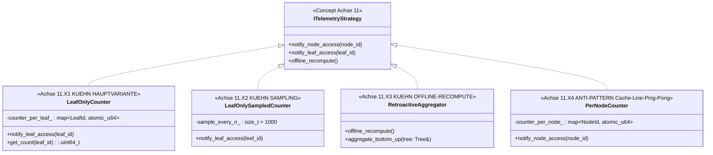
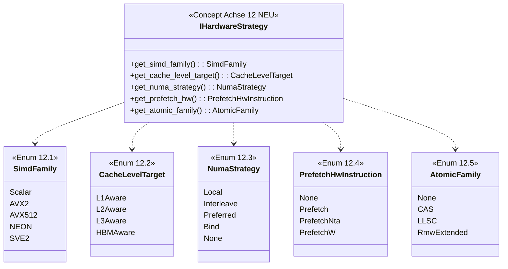
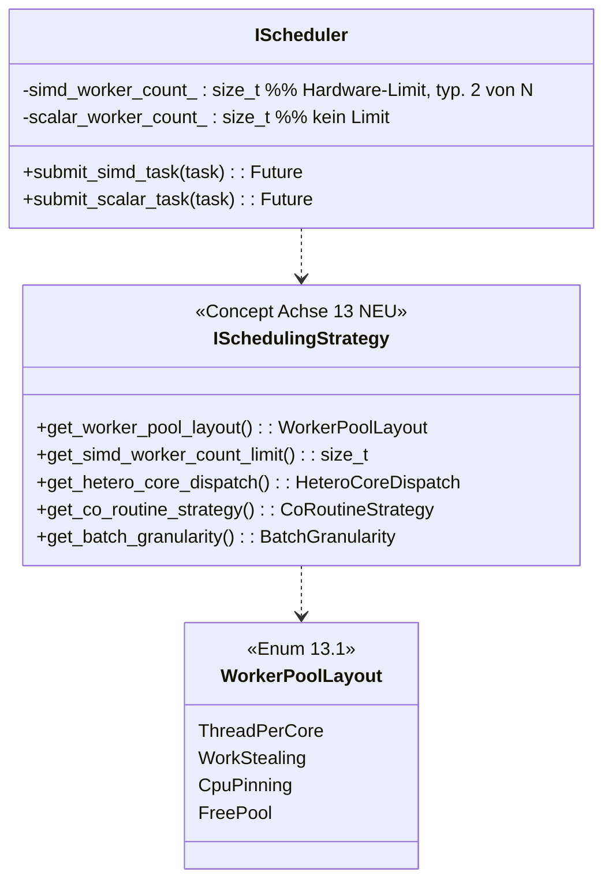
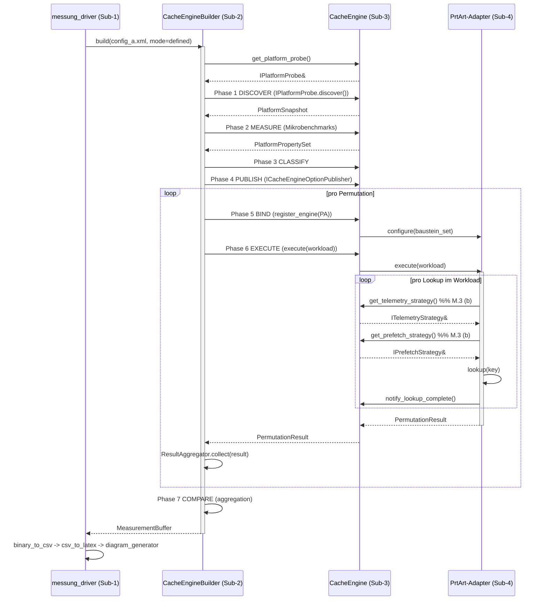
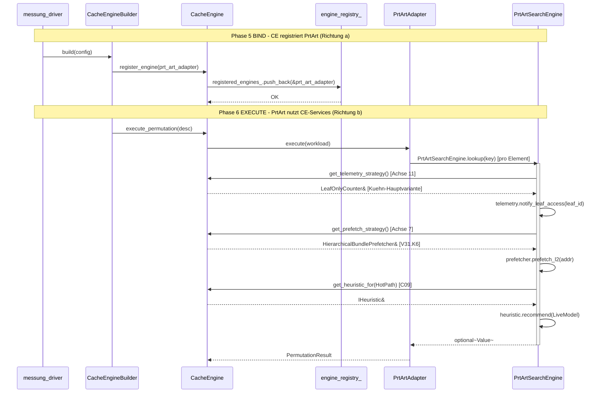

# Z.1 — Soll-UML comdare-cache-engine (Master)

> ⚠️ **SUPERSEDED (2026-05-31):** Überholter Planungs-/Architektur-Stand (axis-zentrische Restruktur F.2, Plugin-Prüfling-Modell, DLL-F15-Pipeline, sezierte Organe). IST-treue Single-Source-of-Truth: `comdare-cache-engine/docs/ledger-sections/architektur-ziele-offene-punkte-ledger.md` + `…/20260531-e2e-abnahme-audit-und-entscheidungen.md`. Niemals löschen — nur Banner.

**Stand:** 2026-05-18 (Z.1)
**Vorgaenger:** `Y1_cache_engine_ist_kartografie.md` (Ist-Bestandsaufnahme)
**Konsequenz:** V32+ Code-Refactoring nach diesen Klassendiagrammen

> Soll-UML fuer cache-engine. Hybrid-Format: Mermaid inline (Klassen-Hierarchien + Sequence-Diagramme) + Verweise auf drawio-Tabs (komplexe Klassendiagramme via Phase P-Erweiterungen).

---

## §1 Master-Klassen-Diagramm CacheEngine + Builder + ABI

---

## §2 12 Sub-Engines C01-C12 — Klassen-Hierarchie

```mermaid
classDiagram
    class ISubEngine {
        <<Concept>>
        +sub_engine_kind() : SubEngineKind
        +configure(perm: PermutationFlags)
        +reset()
    }

    class C01_CostEngine {
        +estimate_layout_cost(layout: ILayout) : Cost
    }
    class C02_PinningEngine {
        +pin_thread(thread_id, core_id)
        +get_numa_node(core_id) : NumaNode
    }
    class C03_PrefetchEngine {
        +prefetch_l1(addr)
        +prefetch_l2(addr)
        +prefetch_l3(addr)
        +get_hierarchical_bundle() : HierarchicalBundlePrefetcher&
    }
    class C04_CoherenceEngine {
        +detect_false_sharing(cache_line_id) : bool
        +recommend_write_strategy() : WriteStrategy
    }
    class C05_TelemetryEngine {
        +get_leaf_only_counter() : LeafOnlyCounter&
        +get_sampled_counter() : LeafOnlySampledCounter&
        +get_retroactive_aggregator() : RetroactiveAggregator&
        +get_per_node_counter_legacy() : PerNodeCounter&  %% Achse 11.X4 ANTI-PATTERN
    }
    class C06_AllocationEngine {
        +get_allocator(strategy: AllocStrategy) : IAllocator&
        +get_pool(pool_kind: PoolKind) : IPool&
    }
    class C07_MigrationEngine {
        +migrate_page(from, to)
    }
    class C08_EncodingEngine {
        +get_louds_encoder() : ILoudsEncoder&
        +get_succinct_encoder() : ISuccinctEncoder&
    }
    class C09_HeuristikEngine {
        +recommend(context) : Recommendation
        +get_hardware_probe() : C8_HardwareProbing&  %% NICHT identisch mit Achse 12!
    }
    class C10_TopologieEngine {
        +get_cache_topology() : ICacheTopology&
        +get_cpu_layout() : ICoreLayout&
    }
    class C11_SchedulerEngine {
        +get_worker_pool() : IWorkerPool&
        +get_simd_worker_count_limit() : size_t  %% Hardware-Limit, typ. 2 von N
    }
    class C12_FilterEngine {
        +get_bloom_filter() : BloomFilter&
        +get_surf_filter() : SurfFilter&
    }

    ISubEngine <|-- C01_CostEngine
    ISubEngine <|-- C02_PinningEngine
    ISubEngine <|-- C03_PrefetchEngine
    ISubEngine <|-- C04_CoherenceEngine
    ISubEngine <|-- C05_TelemetryEngine
    ISubEngine <|-- C06_AllocationEngine
    ISubEngine <|-- C07_MigrationEngine
    ISubEngine <|-- C08_EncodingEngine
    ISubEngine <|-- C09_HeuristikEngine
    ISubEngine <|-- C10_TopologieEngine
    ISubEngine <|-- C11_SchedulerEngine
    ISubEngine <|-- C12_FilterEngine
```

---

## §3 PermutationFlags V32.2 — 14 Banks Struct

---

## §4 Telemetry Achse 11 — Kuehn-Strategien V32 Doku-Mapping

---

## §5 Hardware-Strategy (NEU Achse 12, V32 + O.3)

---

## §6 Scheduling-Strategy (NEU Achse 13, V32 + O.3)

---

## §7 Sequence-Diagramm: Phasen 1-7 Pipeline (Master)

---

## §8 V32+ Sequence-Diagramm: register_engine + bidirektionale Calls (M.3)

---

## §9 V32 Refactoring-Klassen-Map

| Existierende V31-Klasse | V32-Refactoring | Sub-Achse |
|---|---|---|
| `permutation_flags.hpp` (9 Banks) | + 5 NEUE Banks (12 HW, 13 Sched, 14 EngineChoice) + 3 Splits (3.A/B/M, 6.1-5, 8.1+2) | Achse 12+13 |
| `i_telemetry_strategy.hpp` | + 4 Doxygen-Marker fuer Kuehn 11.X1-X4 (Klasse existiert!) | Achse 11 |
| `concepts/disciplines/path_discipline.hpp` | splitten in `search_algo_traversal.hpp` + `cache_memory_traversal.hpp` + `traversal_mapping.hpp` | Achse 3 |
| NEU `concepts/hardware_strategy.hpp` | + 5 Sub-Achsen-Enum + Default-Variant | Achse 12 |
| NEU `concepts/scheduling_strategy.hpp` | + 5 Sub-Achsen-Enum + IScheduler-API | Achse 13 |
| NEU `concepts/numa_affinity.hpp` | + Enum + IAllocator-Hook | Achse 6.3 |
| `allocators/concepts/locking_concept.hpp` | + `LockingMode` Enum explizit | Achse 8.2 |

---

## §10 drawio-Tab-Vorschlaege fuer Z.1 (P.4-Erweiterung)

Pro Hauptklassen-Gruppe ein neuer drawio-Tab (komplexe Klassen-Beziehungen, die Mermaid-Beschraenkungen ueberschreiten):

| drawio-Tab-Vorschlag | Inhalt |
|---|---|
| `Z1-CE-Master-Klassen` | CacheEngine + 12 Sub-Engines + ABI |
| `Z1-PermutationFlags-V32-Bitfield` | 14-Banks-Bitfield-Layout grafisch |
| `Z1-Telemetry-Achse11-Hierarchie` | ITelemetryStrategy + 4 Kuehn-Strategien |
| `Z1-Hardware-Strategy-NEU` | IHardwareStrategy + 5 Sub-Achsen-Enums |
| `Z1-Scheduling-Strategy-NEU` | ISchedulingStrategy + IScheduler |
| `Z1-Pipeline-Phasen-1-7-Detail` | CEB + CE + PA Subsystem-Trennung pro Phase |

---

## §11 Querverweise

- Y.1 Ist-Kartografie cache-engine: `Y1_cache_engine_ist_kartografie.md`
- O-Phase PRT-ART-Spiegel: `../adapters/O_PHASE_PRT_ART_AXES_MIRROR.md`
- V32 Code-Refactoring-Plan: `../adapters/V32_CODE_REFACTORING_PLAN.md`
- M-Modell: `../architektur/10_schichten_modell_M.md`
- Anti-Vermischung: `../architektur/11_axes_vs_strategies_disambiguation.md`
- Bausteine 14 Achsen: `../bausteine/07_bausteine_matrix_N_erweitert.md`

---

**Ende docs/uml_planning/Z1_soll_uml_cache_engine.md (Z.1 DONE).**
