# Z.2 — Soll-UML comdare-prt-art (Pruefling-Spiegel mit 14-Achsen-Module)

**Stand:** 2026-05-18 (Z.2)
**Vorgaenger:** `Y2_prt_art_ist_kartografie.md` + `../adapters/O_PHASE_PRT_ART_AXES_MIRROR.md`
**Konsequenz:** V32.1 Code-Refactoring der PrtArtSearchEngine

> Soll-UML fuer PRT-ART als Bausteine-Spiegel zur CacheEngine. Hybrid: Mermaid + drawio-Verweise.

---

## §1 PrtArtSearchEngine Template-Hierarchie (V32.1 Soll, 20+ Params)

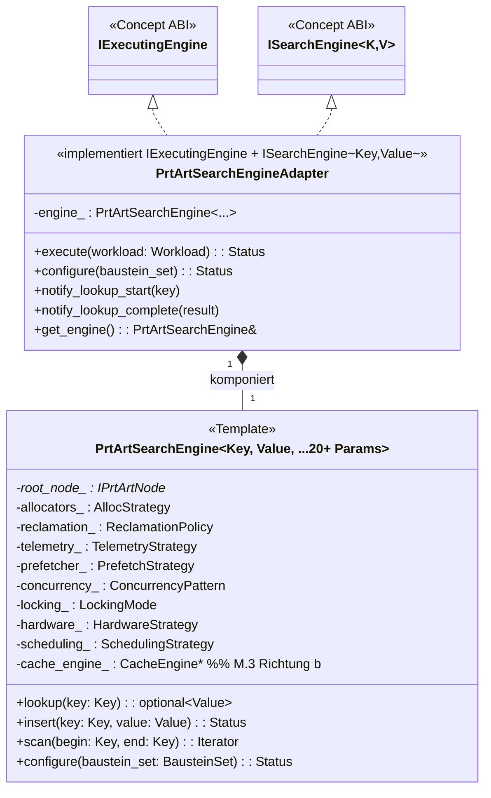

---

## §2 IPrtArtNode-Familie (Achse 1+2)

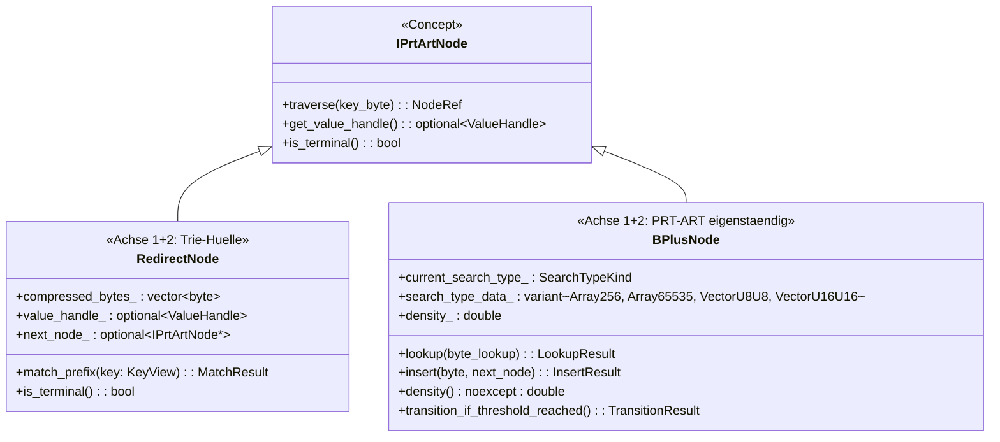

---

## §3 4 Suchtypen A/B/C/D (Achse 2 Sub-Permutation, K05b)

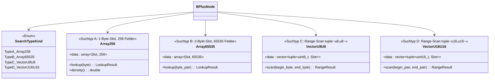

---

## §4 4+2 Pool-Familie (Achse 6.1, K05e)

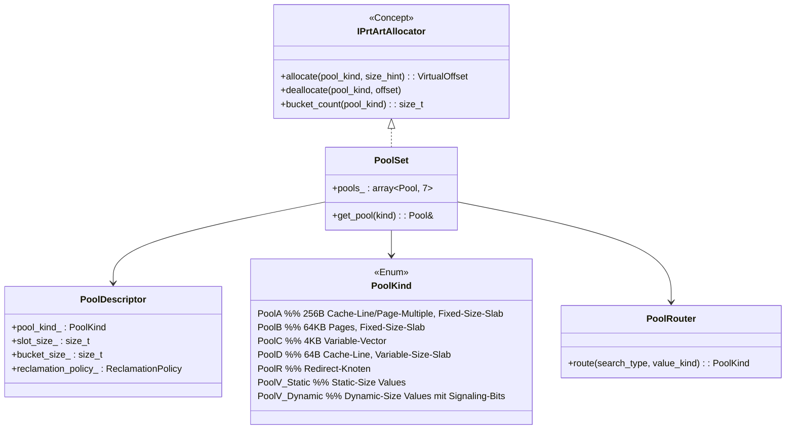

---

## §5 Concurrency K05g (Achse 8.1 + 8.2)

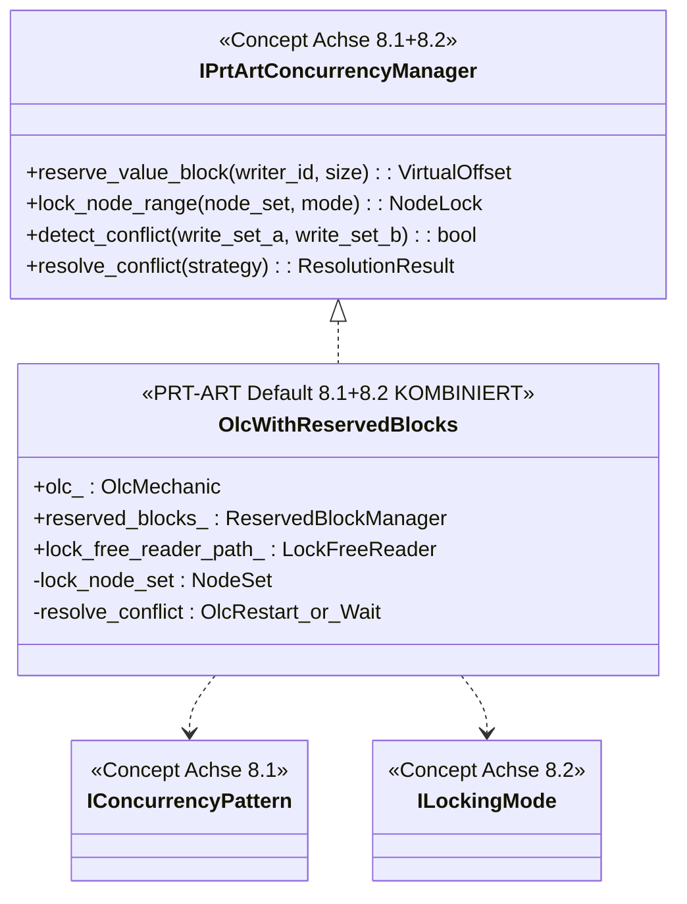

---

## §6 Prefetch (Achse 7) — Spiegel-Klassen + V31.K6 Reuse

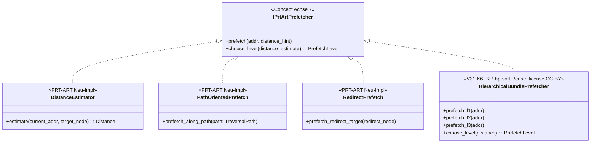

---

## §7 NEUE Spiegel-Module fuer fehlende Achsen (O.3 Soll-Implementation)

### §7.1 prt_art/hardware/ (Achse 12, V32 NEU)

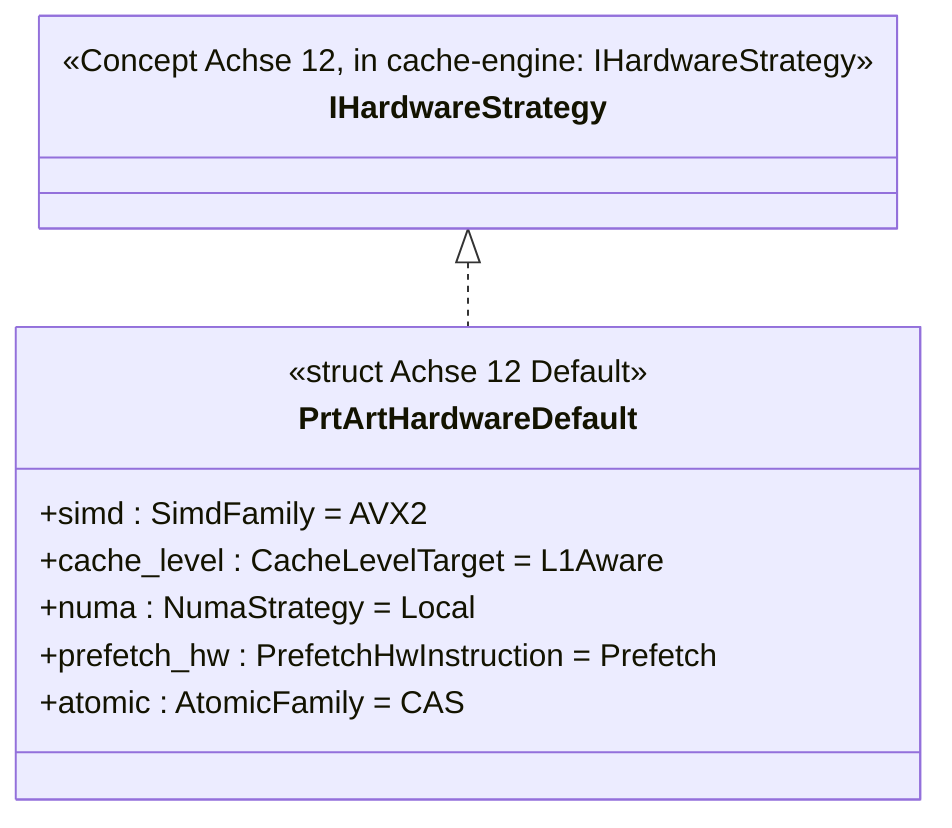

### §7.2 prt_art/scheduling/ (Achse 13, V32 NEU)

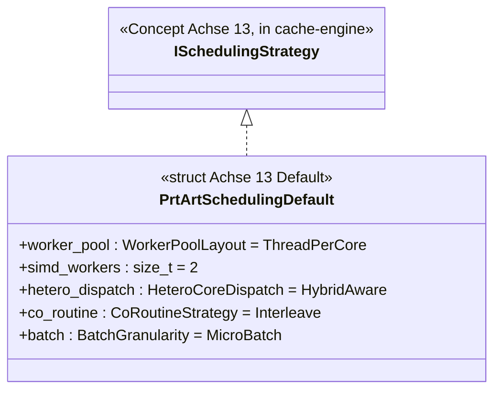

### §7.3 prt_art/traversal/ (Achse 3.B + 3.M, V32 NEU)

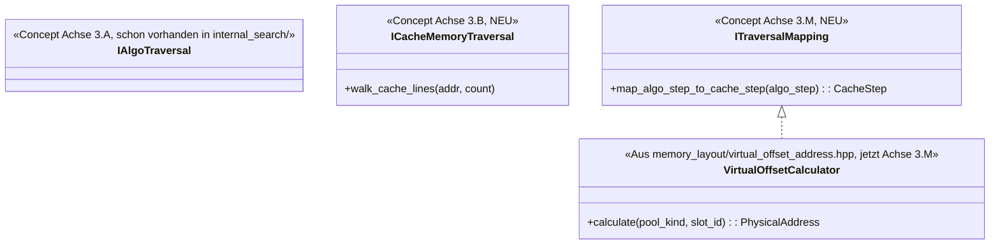

### §7.4 prt_art/telemetry/ (Achse 11, V32 NEU, Reuse CE)

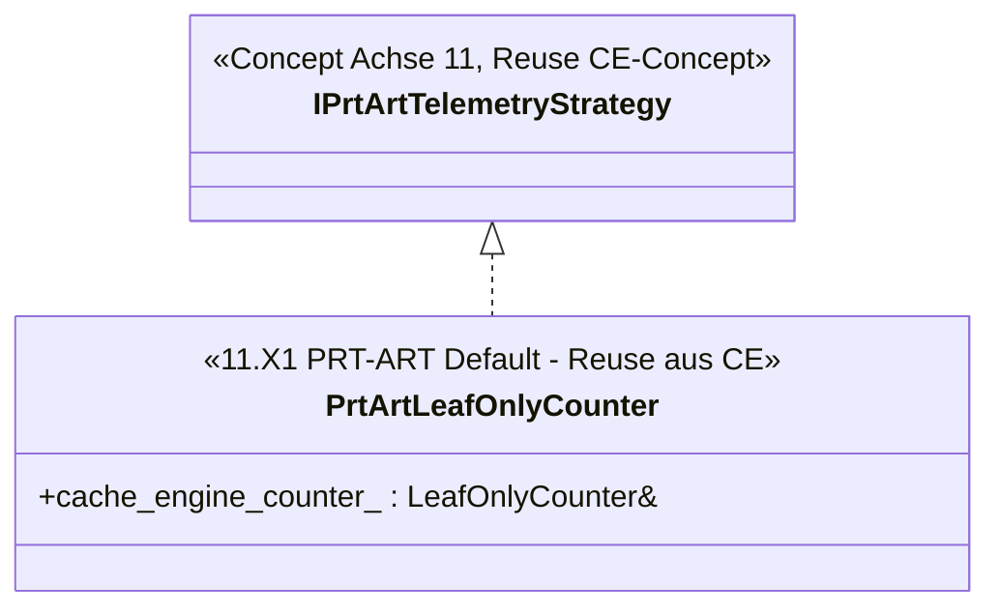

---

## §8 Sequence-Diagramm: PrtArt-Lookup mit bidirektionaler CE-Service-Nutzung

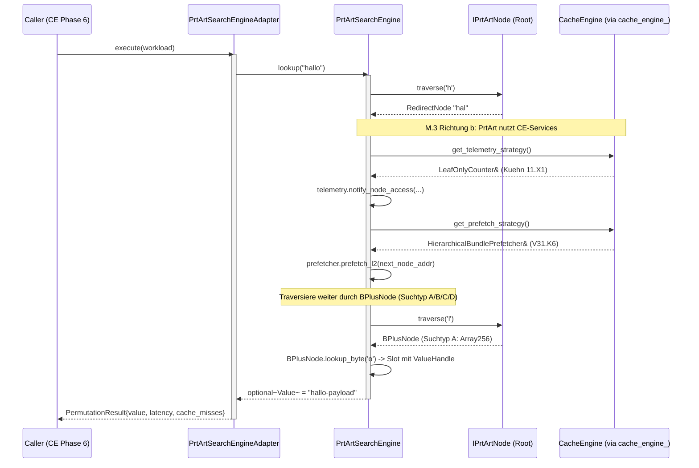

---

## §9 V32+ Refactoring-Klassen-Map (Pendant zu O.6)

| Existierende V31-Klasse | V32-Refactoring | Status |
|---|---|---|
| `prt_art_search_engine.hpp` (12 Template-Params) | + 8 NEUE Template-Params (auf 20+) | V32.1 |
| `memory_layout/virtual_offset_address.hpp` | → `traversal/traversal_mapping.hpp` | O.3 |
| `internal_search/array_*.hpp` + `vector_*.hpp` | → `traversal/search_algo_traversal.hpp` (Reorganisation) | O.3 |
| (FEHLT) | NEU `traversal/cache_memory_traversal.hpp` | O.3 |
| (FEHLT) | NEU `hardware/prt_art_hardware_strategy.hpp` + Sub-Achsen | O.3 |
| (FEHLT) | NEU `scheduling/prt_art_scheduling_strategy.hpp` + Sub-Achsen | O.3 |
| (FEHLT) | NEU `telemetry/prt_art_telemetry_strategy.hpp` (Reuse CE) | O.3 |
| (FEHLT) | NEU `isa/isa_features.hpp` | O.3 |
| (FEHLT) | NEU `allocator/reclamation_policy.hpp` + `numa_affinity.hpp` + `huge_page_policy.hpp` | O.3 |

---

## §10 drawio-Tab-Vorschlaege fuer Z.2 (analog Z.1 §10)

| drawio-Tab-Vorschlag | Inhalt |
|---|---|
| `Z2-PrtArt-Template-20-Params` | PrtArtSearchEngine V32.1 mit 20+ Template-Params + Default-Variants |
| `Z2-IPrtArtNode-Familie` | RedirectNode + BPlusNode (4 Suchtypen) Detail |
| `Z2-4plus2-Pool-Familie` | PoolRouter + 7 Pools mit Routing |
| `Z2-PRT-ART-Concurrency-K05g` | OlcWithReservedBlocks + 3 Mechaniken |
| `Z2-PRT-ART-Achsen-Spiegel` | Pro Achse 1-14 die PRT-ART-Klasse(n) |

---

## §11 Querverweise

- Y.2 Ist-Kartografie prt-art: `Y2_prt_art_ist_kartografie.md`
- O-Phase PRT-ART-Spiegel: `../adapters/O_PHASE_PRT_ART_AXES_MIRROR.md`
- V32 Code-Refactoring (V32.1 Template): `../adapters/V32_CODE_REFACTORING_PLAN.md` §1
- Z.1 cache-engine-Pendant: `Z1_soll_uml_cache_engine.md`

---

**Ende docs/uml_planning/Z2_soll_uml_prt_art.md (Z.2 DONE).**
