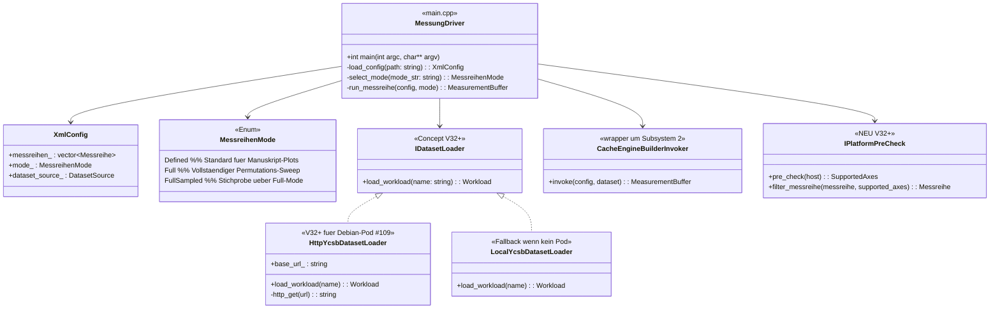
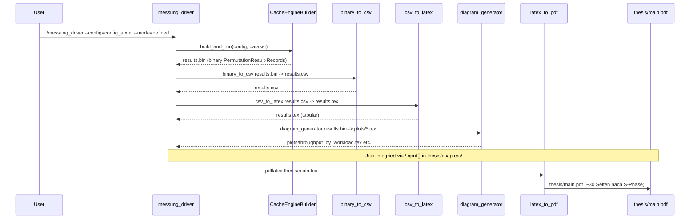
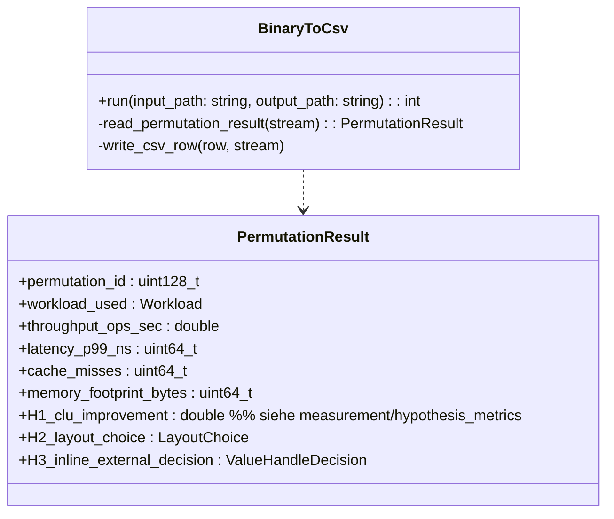
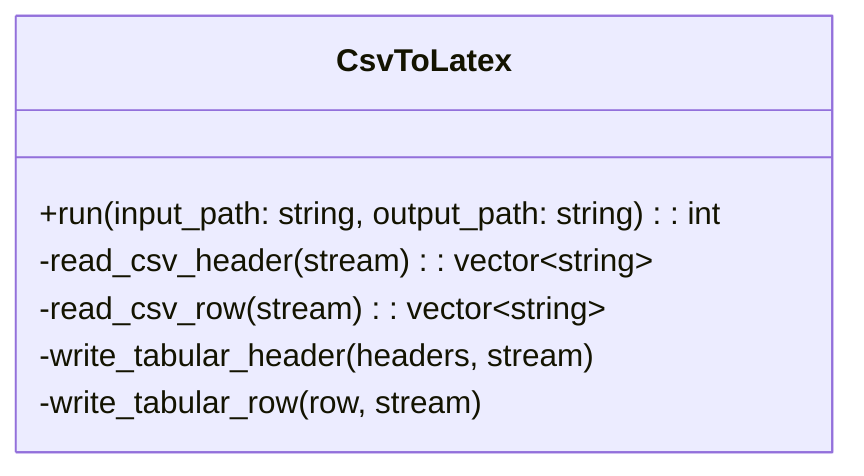
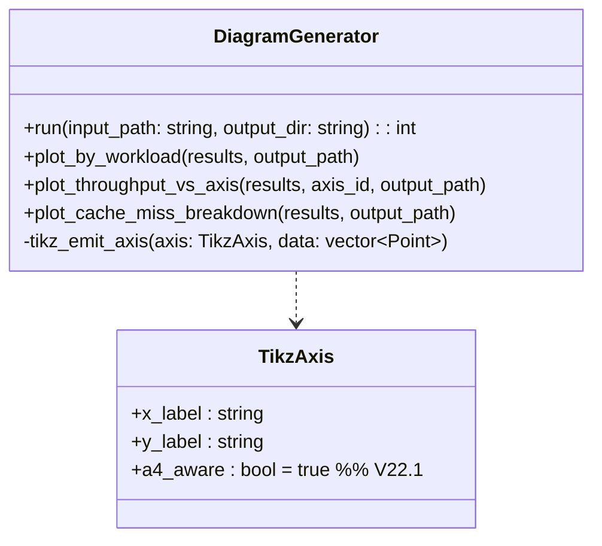
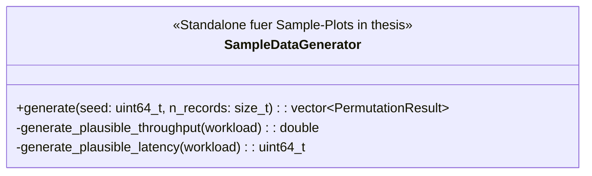
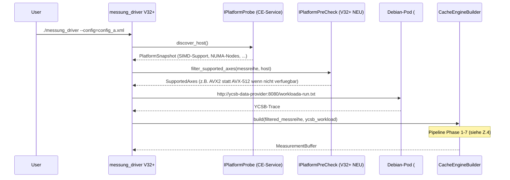
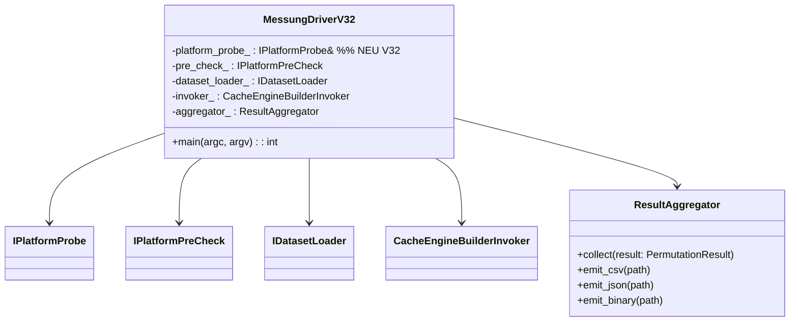

# Z.3 — Soll-UML Diplomarbeit/Code/ (messung_driver Outer-Loop + Tool-Chain)

> ⚠️ **SUPERSEDED (2026-05-31):** Überholter Planungs-/Architektur-Stand (axis-zentrische Restruktur F.2, Plugin-Prüfling-Modell, DLL-F15-Pipeline, sezierte Organe). IST-treue Single-Source-of-Truth: `comdare-cache-engine/docs/sessions/architektur-ziele-offene-punkte-ledger.md` + `…/20260531-e2e-abnahme-audit-und-entscheidungen.md`. Niemals löschen — nur Banner.

**Stand:** 2026-05-18 (Z.3)
**Vorgaenger:** `Y3_diplomarbeit_code_ist_kartografie.md`
**Konsequenz:** V32+ messung_driver-Erweiterung + Tool-Chain-Integration

> Soll-UML fuer Subsystem 1 (Outer-Loop). Mermaid inline.

---

## §1 messung_driver Master-Klassen-Diagramm (V32+ Soll)

---

## §2 Tool-Chain Sequence-Diagramm (Phase 7 → thesis-Anhang)

---

## §3 Tool-Klassen-Diagramme

### §3.1 binary_to_csv

### §3.2 csv_to_latex

### §3.3 diagram_generator (V22.1 plot_by_workload)

### §3.4 sample_data_generator (V21.3, wird durch reale Daten ersetzt)

---

## §4 V32+ messung_driver Erweiterung (Q.1 + #109)

---

## §5 V32+ Klassen-Hierarchie (komplett)

---

## §6 drawio-Tab-Vorschlag fuer Z.3

| drawio-Tab | Inhalt |
|---|---|
| `Z3-MessungDriver-V32-Master` | Klassen-Diagramm Subsystem 1 mit allen V32+ Erweiterungen |
| `Z3-ToolChain-Pipeline` | Sequence vom Run-Beginn bis thesis-PDF |

---

## §7 Querverweise

- Y.3 Ist-Kartografie: `Y3_diplomarbeit_code_ist_kartografie.md`
- Q.1 Datasets-Plan: `../adapters/Q_PHASE_DATASETS_F_EXTRA_PLAN.md` §1
- I109 Debian-Pod: `../infra/I109_DEBIAN_POD_YCSB_DATA_PROVIDER.md`
- M-Modell Subsystem 1: `../architektur/10_schichten_modell_M.md` §2.1
- Z.1 cache-engine-Pendant: `Z1_soll_uml_cache_engine.md`

---

**Ende docs/uml_planning/Z3_soll_uml_diplomarbeit_code.md (Z.3 DONE).**
