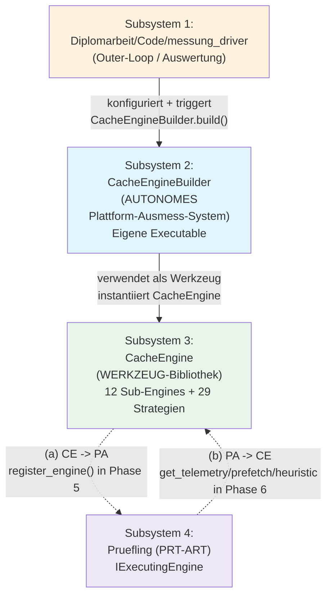
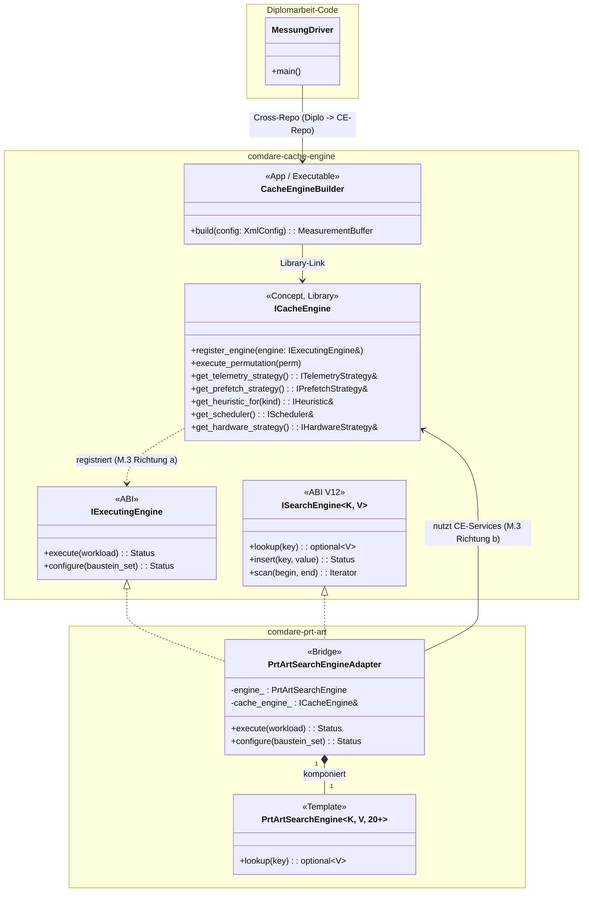
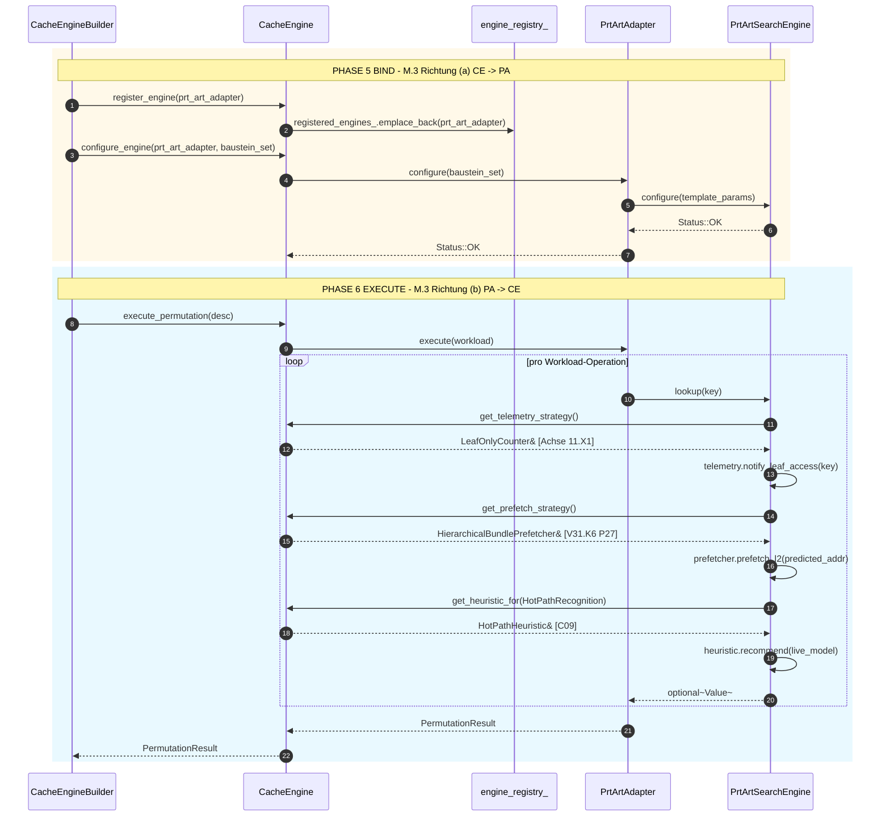
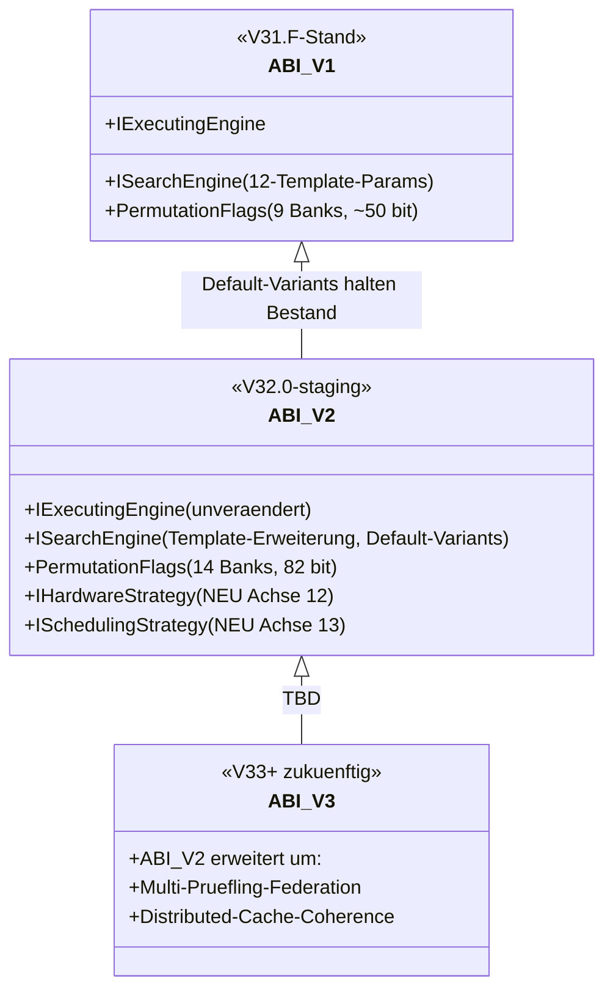
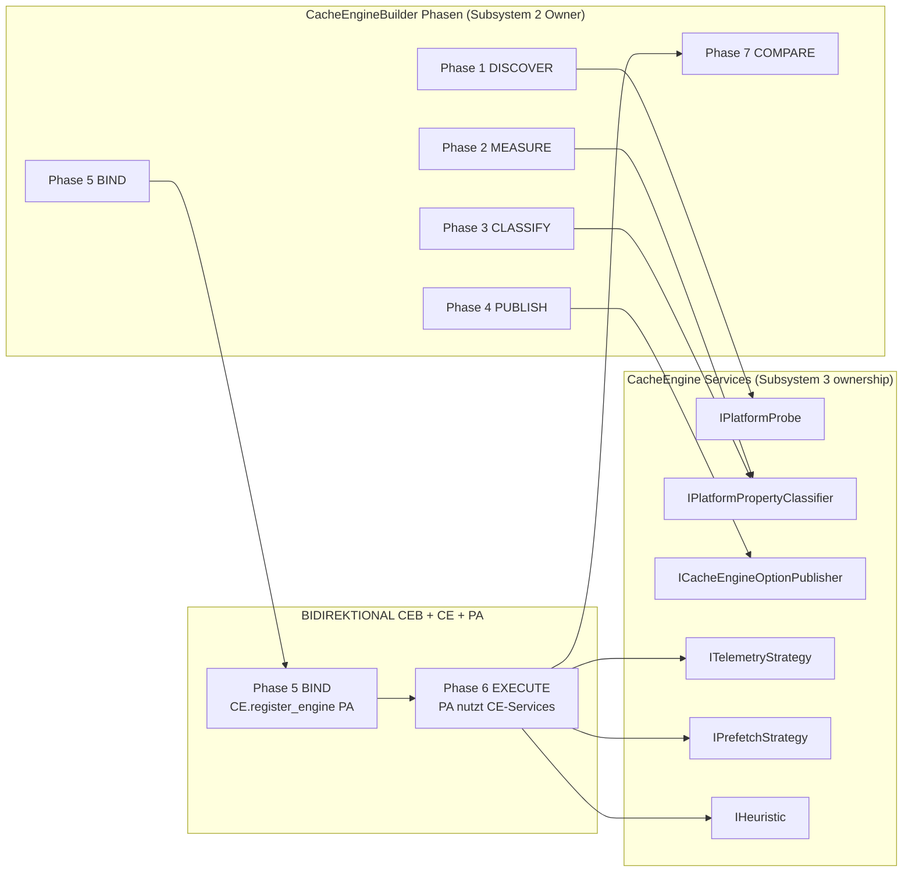
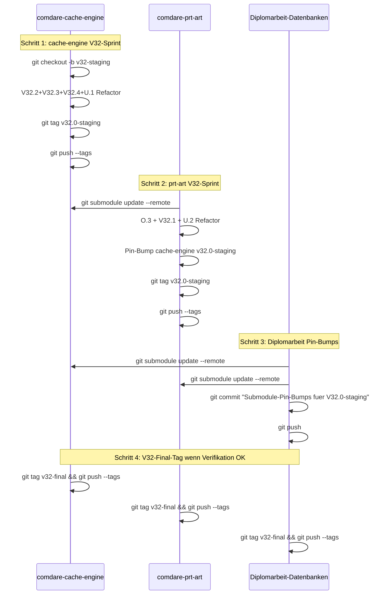

# Z.4 — Soll-UML Cross-Repo bidirektionale Schnittstellen (M-Modell)

> ⚠️ **SUPERSEDED (2026-05-31):** Überholter Planungs-/Architektur-Stand (axis-zentrische Restruktur F.2, Plugin-Prüfling-Modell, DLL-F15-Pipeline, sezierte Organe). IST-treue Single-Source-of-Truth: `comdare-cache-engine/docs/ledger-sections/architektur-ziele-offene-punkte-ledger.md` + `…/20260531-e2e-abnahme-audit-und-entscheidungen.md`. Niemals löschen — nur Banner.

**Stand:** 2026-05-18 (Z.4)
**Vorgaenger:** `Y4_cross_repo_beziehungen.md` + `../architektur/10_schichten_modell_M.md`
**Konsequenz:** ABI-Stabilitaet zwischen den 3 Repos

> Soll-UML der API-Grenzen zwischen Subsystemen. Hybrid: Mermaid-Sequence + Klassen-Diagramm.

---

## §1 M-Modell 4-Subsystem-Schichten-Diagramm

---

## §2 Cross-Repo ABI-Klassen-Diagramm

---

## §3 Bidirektionale CE↔PA Sequence-Detail

---

## §4 ABI-Stabilitaets-Garantien (V32 → V33+ Roadmap)

**Migrations-Mapper V31 → V32:**
- Alte 9-Banks-PermutationFlags → V32-Adapter mapped auf 14-Banks mit Defaults
- Alte 12-Template-Param PrtArtSearchEngine → V32-Default-Variants fuer neue Params

---

## §5 Phasen-Owner-Matrix (M-Modell + Pipeline)

---

## §6 V32-Submodule-Pin-Synchronisation Sequence

---

## §7 drawio-Tab-Vorschlaege fuer Z.4

| drawio-Tab | Inhalt |
|---|---|
| `Z4-M-Modell-Cross-Repo-Master` | 4-Subsystem-Schichten-Schema mit Repo-Grenzen markiert |
| `Z4-ABI-Stabilitaets-Roadmap` | ABI V1 → V2 → V3 Vererbung mit Migrations-Mappers |
| `Z4-Phasen-Owner-Matrix` | Phase 1-7 Owner-Zuordnung CEB vs CE vs PA |

---

## §8 Querverweise

- Y.4 Cross-Repo-Beziehungen: `Y4_cross_repo_beziehungen.md`
- M-Modell: `../architektur/10_schichten_modell_M.md`
- V32 Submodule-Workflow: `../adapters/V32_CODE_REFACTORING_PLAN.md` §7
- Z.1/Z.2/Z.3 Repo-Pendants: `Z1_*.md`, `Z2_*.md`, `Z3_*.md`

---

**Ende docs/uml_planning/Z4_soll_uml_cross_repo_bidi.md (Z.4 DONE).**
