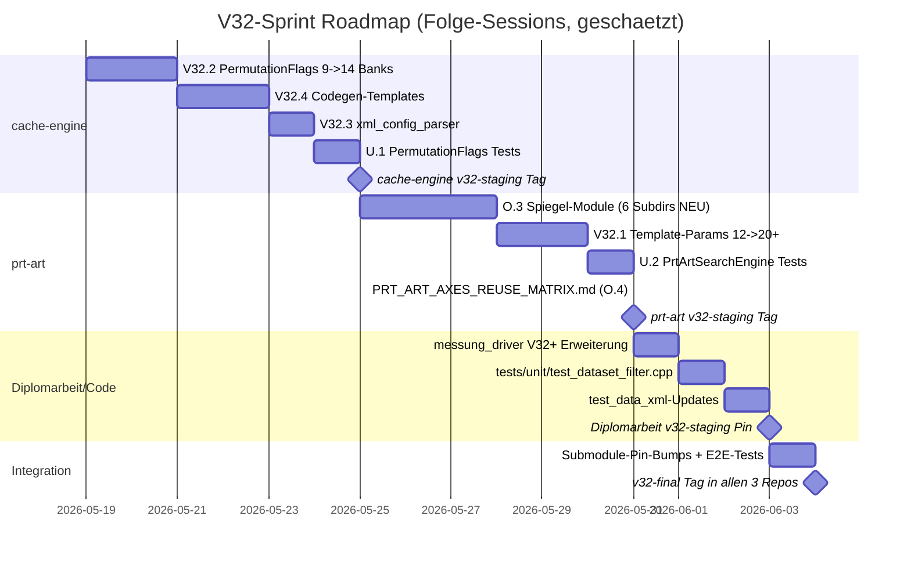

# Z.5 — Master-UML-INDEX + Gap-Analyse Ist-vs-Soll

**Stand:** 2026-05-18 (Z.5, Z-Phase Abschluss)
**Vorgaenger:** Y.1-Y.4 (Ist) + Z.1-Z.4 (Soll)
**Konsequenz:** Diese Gap-Liste ist die **direkte V32+ Code-Sprint-Vorlage**

> Master-INDEX aller UML-Doks + Gap-Analyse pro Klasse. Mermaid + Tabellen.

---

## §1 docs/uml_planning/ Verzeichnis-Index

```
docs/uml_planning/
├── Y1_cache_engine_ist_kartografie.md      (Ist Repo 1, 290+ Zeilen)
├── Y2_prt_art_ist_kartografie.md           (Ist Repo 2, 290+ Zeilen)
├── Y3_diplomarbeit_code_ist_kartografie.md (Ist Repo 3, 210+ Zeilen)
├── Y4_cross_repo_beziehungen.md            (Cross-Repo + Submodule-Pins, 240+ Zeilen)
├── Z1_soll_uml_cache_engine.md             (Soll Repo 1, 11 Sektionen Mermaid)
├── Z2_soll_uml_prt_art.md                  (Soll Repo 2, 11 Sektionen Mermaid)
├── Z3_soll_uml_diplomarbeit_code.md        (Soll Repo 3, 7 Sektionen Mermaid)
├── Z4_soll_uml_cross_repo_bidi.md          (Soll Cross-Repo, 8 Sektionen Mermaid)
└── Z5_master_index_und_gap_analyse.md      (DIESES Dokument)
```

**Total UML-Planning-Doks:** 9 Files.
**Mermaid-Diagramme inline:** ca. 40-50 (Klassen + Sequence + Flowchart).
**drawio-Tabs (Verweis, V32+ Folge-Session):** ca. 20 als Vorschlag aufgelistet.

---

## §2 Konsolidierungs-Master-Diagramm (Z.5 Master)

```mermaid
flowchart LR
    subgraph Y["Y-Phase: IST-Kartografie (2026-05-18)"]
        Y1[Y.1 cache-engine<br/>193 Header / 12 Sub-Engines / 22 Adapter]
        Y2[Y.2 prt-art<br/>30 Header / 4+2 Pools / 4 Suchtypen]
        Y3[Y.3 Diplomarbeit/Code<br/>6 Tools / messung_driver Outer-Loop]
        Y4[Y.4 Cross-Repo<br/>Submodule-Pins + ABI-Grenzen]
    end

    subgraph Z["Z-Phase: SOLL-UML (2026-05-18)"]
        Z1[Z.1 cache-engine Soll<br/>14-Achsen + V32-Refactoring-Map]
        Z2[Z.2 prt-art Soll<br/>20+ Template-Params + Spiegel-Module]
        Z3[Z.3 Diplomarbeit/Code Soll<br/>V32+ HTTP-Loader + Pre-Check]
        Z4[Z.4 Cross-Repo Bidi<br/>M.3 (a)+(b) Sequence-Detail]
    end

    subgraph V32["V32+ Code-Sprint (Folge-Session)"]
        V321[V32.1 prt-art Template]
        V322[V32.2 cache-engine PermutationFlags]
        V323[V32.3 xml_config_parser]
        V324[V32.4 Codegen-Templates]
    end

    Y1 --> Z1
    Y2 --> Z2
    Y3 --> Z3
    Y4 --> Z4
    Z1 --> V322
    Z1 --> V323
    Z1 --> V324
    Z2 --> V321
    Z3 --> V323
    Z4 --> V321
    Z4 --> V322

    style Y fill:#FFF3E0
    style Z fill:#E1F5FE
    style V32 fill:#EDE7F6
```

---

## §3 GAP-ANALYSE pro Repo (Ist vs Soll)

### §3.1 cache-engine Gap (Y.1 vs Z.1)

| Klasse / Modul | Ist V31.F | Soll Z.1 | Gap-Status | V32-Task |
|---|---|---|---|---|
| `permutation_flags.hpp` | 9 Banks (~50 bit) | 14 Banks (82 bit) | **REFACTOR** | V32.2 |
| `concepts/i_telemetry_strategy.hpp` | vorhanden | + 4 Kuehn-Doxygen-Marker (11.X1-X4) | **DOKU** (Code OK) | (Doku-only) |
| `concepts/disciplines/path_discipline.hpp` | 1 Header (monolithisch) | SPLIT in 3 Files (3.A/3.B/3.M) | **SPLIT** | O.3 + V32.1 |
| `concepts/hardware_strategy.hpp` | **FEHLT** | NEU mit 5 Sub-Achsen-Enums | **NEU** | V32 NEU |
| `concepts/scheduling_strategy.hpp` | **FEHLT** | NEU mit 5 Sub-Achsen-Enums | **NEU** | V32 NEU |
| `concepts/numa_affinity.hpp` | **FEHLT** | NEU (Achse 6.3) | **NEU** | V32 NEU |
| `allocators/concepts/locking_concept.hpp` | vorhanden | + LockingMode Enum explizit (8.2) | **ERWEITERN** | V32 NEU |
| `xml_config_parser/` | parsed 9 Banks | parsed 14 Banks + Sub-Banks | **REFACTOR** | V32.3 |
| `codegen/templates/` | 9 Banks encoder/decoder | 14 Banks encoder/decoder (3+6+8 Sub-Splits) | **REFACTOR** | V32.4 |
| `tests/unit/test_permutation_flags.cpp` | (existiert) | + Tests fuer 14 Banks | **ERWEITERN** | U.1 |

**Bilanz cache-engine:** 1 Doku-only, 3 REFACTOR, 3 NEU, 2 ERWEITERN, 1 SPLIT = **10 V32+ Aenderungen**.

### §3.2 prt-art Gap (Y.2 vs Z.2)

| Klasse / Modul | Ist V31.F | Soll Z.2 | Gap-Status | V32-Task |
|---|---|---|---|---|
| `prt_art_search_engine.hpp` | 12 Template-Params | 20+ Template-Params + Default-Variants | **REFACTOR** | V32.1 |
| `prt_art/hardware/` | **FEHLT** | NEU 6 Header (Strategy + 5 Sub-Achsen) | **NEU** | O.3 |
| `prt_art/scheduling/` | **FEHLT** | NEU 6 Header (Strategy + 5 Sub-Achsen) | **NEU** | O.3 |
| `prt_art/traversal/` | **FEHLT** (in memory_layout/ teilweise) | NEU 3 Header (3.A + 3.B + 3.M) | **NEU + REORGANISE** | O.3 |
| `prt_art/telemetry/` | **FEHLT** (Reuse CE) | NEU 5 Header (Reuse CE Kuehn 11.X1-X4) | **NEU** | O.3 |
| `prt_art/isa/` | **FEHLT** | NEU `isa_features.hpp` (Achse 9) | **NEU** | O.3 |
| `prt_art/allocator/` | 3 Header (Pool-Familie) | + 3 Header (Reclamation/NUMA/HugePage) | **ERWEITERN** | O.3 |
| `memory_layout/virtual_offset_address.hpp` | in memory_layout/ | VERSCHIEBE nach traversal/traversal_mapping.hpp | **MOVE** | O.3 |
| `concurrency/olc_with_reserved_blocks.hpp` | + 8.1 + 8.2 zusammen | klare 8.1 + 8.2 Trennung | **DOKU + Concept-Split** | O.3 |
| `docs/PRT_ART_AXES_REUSE_MATRIX.md` | **FEHLT** | NEU Tabelle aus O.4 | **NEU DOKU** | O.4 |
| `prt_art/tests/test_prt_art_identity.cpp` | 51 Tests | + 8 Tests fuer neue Template-Params | **ERWEITERN** | U.2 |

**Bilanz prt-art:** 5 NEU-Verzeichnisse, 2 ERWEITERN, 1 MOVE, 1 DOKU+Split, 1 REFACTOR, 1 NEU DOKU = **11 V32+ Aenderungen**.

### §3.3 Diplomarbeit/Code/ Gap (Y.3 vs Z.3)

| Klasse / Modul | Ist V31.F | Soll Z.3 | Gap-Status | V32-Task |
|---|---|---|---|---|
| `messung_driver/main.cpp` | XML-Loader + Loop | + IPlatformProbe + IPlatformPreCheck + HttpYcsbDatasetLoader | **ERWEITERN** | Q.1 + #109 |
| `messung_driver/dataset_loader.cpp` | (existiert nicht) | NEU mit Local + Http Loader | **NEU** | Q.1 |
| `tests/unit/test_dataset_filter.cpp` | **FEHLT** | NEU mit Hardware-Verfuegbarkeits-Test | **NEU** | Q.1 |
| `test_data_xml/config_*.xml` | 11-Achsen XML | + 3-Sub-Achsen-Tags (hw_*, sched_*) | **ERWEITERN** | V32.3 |
| `diagram_generator/diagram_generator.cpp` | plot_by_workload | + plot_by_axis (1-14 Achsen) | **ERWEITERN** | (S.3 follow-up) |

**Bilanz Diplomarbeit/Code:** 3 ERWEITERN, 2 NEU = **5 V32+ Aenderungen**.

### §3.4 Cross-Repo Gap (Y.4 vs Z.4)

| Aspekt | Ist V31.F | Soll Z.4 | Gap-Status | V32-Task |
|---|---|---|---|---|
| Submodule-Pin cache-engine | `16176ee` | `v32.0-staging` → `v32-final` | **PIN-BUMP** | V32-Workflow Schritt 3 |
| Submodule-Pin prt-art | `1a36ab4` | `v32.0-staging` → `v32-final` | **PIN-BUMP** | V32-Workflow Schritt 3 |
| ABI V1 → V2 Migration | ABI V1 nur | + Migrations-Mapper alt → neu PermutationFlags | **NEU MAPPER** | V32.2 |
| Tags pro Repo | (V31-final implizit) | `v31-final`, `v32.0-staging`, `v32-final` | **TAGS NEU** | V32-Workflow alle Schritte |

**Bilanz Cross-Repo:** 2 PIN-BUMPS, 1 NEU MAPPER, 1 TAGS = **4 V32+ Aenderungen**.

---

## §4 V32+ Total-Aenderungs-Bilanz

| Repo | NEU | REFACTOR | ERWEITERN | MOVE/SPLIT | DOKU | TOTAL |
|---|---|---|---|---|---|---|
| cache-engine | 3 | 3 | 2 | 1 | 1 | **10** |
| prt-art | 6 | 1 | 2 | 1 | 1 | **11** |
| Diplomarbeit/Code | 2 | 0 | 3 | 0 | 0 | **5** |
| Cross-Repo | 1 | 0 | 0 | 0 | 3 | **4** |
| **TOTAL** | **12** | **4** | **7** | **2** | **5** | **30** |

**30 V32+ Aenderungen** ueber 3 Repos. Geschaetzter Aufwand: 2-4 Sprint-Wochen pro Repo + 1 Sprint fuer Integration.

---

## §5 V32-Sprint-Reihenfolge (kritischer Pfad)



**Geschaetzte Gesamtdauer:** 15-18 Arbeitstage (3-4 Wochen).

---

## §6 Drawio REV8 Roadmap (parallel zur V32-Sprint)

Aus Z.1-Z.4 §"drawio-Tab-Vorschlaege" insgesamt ca. **20 neue drawio-Tabs** in REV7.drawio. Diese sind orthogonal zum Code-Refactoring und koennen jederzeit ergaenzt werden.

| Drawio-Tab-Familie | Anzahl Tabs | Quelle |
|---|---|---|
| Z1-CE-Master-Klassen + 5 weitere CE-Tabs | 6 | Z.1 §10 |
| Z2-PrtArt-Template + 4 weitere PrtArt-Tabs | 5 | Z.2 §10 |
| Z3-MessungDriver + Tool-Chain | 2 | Z.3 §6 |
| Z4-Cross-Repo + ABI-Roadmap + Phasen-Matrix | 3 | Z.4 §7 |
| Z5-Master-Roadmap (Gantt-aehnlich aus §5) | 1 | DIESE Doku |
| **TOTAL** | **17** | (49 + 17 = 66 Tabs nach REV8) |

**Pragmatisch:** drawio-Tabs werden in einer dedizierten Z-drawio-Session ergaenzt (analog P.3/P.4). Aktuell sind die wichtigsten Inhalte bereits als Mermaid in den Z-Doks.

---

## §7 Aktualisierung der Master-Plan-Phasen

Diese Z.5-Doku ist das letzte Stueck des UML-Planning-Sprints. Nach Z.5 ist der Plan komplett fuer:

1. **V32+ Code-Sprint** (cache-engine + prt-art + Diplomarbeit Pin-Bumps): siehe §5 Gantt
2. **Drawio REV8 Tabs** (17 weitere): nach Bedarf in eigener drawio-Session
3. **thesis-Aktualisierung** (S-Phase nach V32 Refactor + nach realen Mess-Daten V21.2): in einer spaeteren Session

---

## §8 USER-Entscheidungen Pending

| Entscheidung | Vorschlag | Beruehrte Phasen |
|---|---|---|
| V32-Sprint jetzt oder nach Manuskript-Stand? | nach realen Mess-Daten + nach Cluster-Migration #77 | V32.1-V32.4 |
| Drawio REV8 17 Tabs jetzt anlegen? | NACH V32-Sprint, mit echten Klassen-Signaturen | P-Phase Folge |
| HW-E2E Mess-Reihe wann? | Sobald Cluster + Pre-flight-Specs umgesetzt | V21.2 (USER) |

---

## §9 Master-Querverweise

| Doku | Inhalt |
|---|---|
| Y-Phase | `Y1_*.md`, `Y2_*.md`, `Y3_*.md`, `Y4_*.md` |
| Z-Phase | `Z1_*.md`, `Z2_*.md`, `Z3_*.md`, `Z4_*.md`, **DIESES Z.5** |
| Architektur Master | `../architektur/02_aktueller_master_REV7_7.md` |
| M-Modell | `../architektur/10_schichten_modell_M.md` |
| Anti-Vermischung | `../architektur/11_axes_vs_strategies_disambiguation.md` |
| Bausteine 14 Achsen | `../bausteine/07_bausteine_matrix_N_erweitert.md` |
| O-Phase Spiegel | `../adapters/O_PHASE_PRT_ART_AXES_MIRROR.md` |
| T-Phase Adapter | `../adapters/T_PHASE_ADAPTER_STATUS.md` |
| V32 Refactoring | `../adapters/V32_CODE_REFACTORING_PLAN.md` |
| Q-Phase Datasets | `../adapters/Q_PHASE_DATASETS_F_EXTRA_PLAN.md` |
| Infra Pre-flight | `../infra/I77/I109/I111_*.md` |
| Sessions 4800+4900 | `../sessions/20260518-{4800,4900}-*.md` |

---

**Ende docs/uml_planning/Z5_master_index_und_gap_analyse.md (Z.5 + Z-Phase DONE).**
